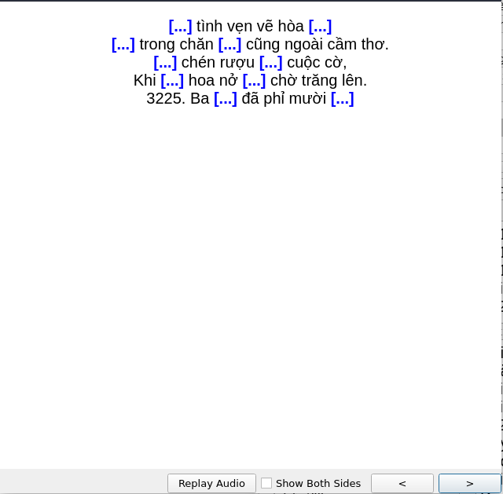
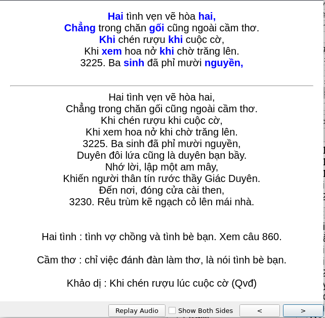

## Demo tạo  Ankin tự động từ nguồn dữ liệu text, csv, epub...
Front             |  Back
:-------------------------:|:-------------------------:
  |  

### 1. Làm quen và khởi động:
#### Cài đặt `genanki`:

```
    git clone https://github.com/kerrickstaley/genanki.git
    cd genanki
    python3 setup.py install
```

Làm theo hướng dẫn [tại đây](ref:https://charly-lersteau.com/posts/2019-11-17-create-anki-deck-csv/) để hiểu cách tạo từ động một Deck Anki từ file txt (hoặc csv) có sẵn.

***
Source code ở [địa chỉ trên](ref:https://charly-lersteau.com/posts/2019-11-17-create-anki-deck-csv/) có thể chạy bằng lệnh:
```
    python3 example.py
```
để tạo file `HSK1.apkg` như hướng dẫn.
***

### 2. Tạo Deck `truyện Kiều` từ bản số `epub`

#### 2.1. Nguồn file số `epub` lấy từ dự án số hóa của TVE-4U ở [đây.](http://tve-4u.org/threads/truye%CC%A3n-kie%CC%80u-nguye%CC%83n-du-ha%CC%80-huy-gia%CC%81p-nguye%CC%83n-tha%CC%A3ch-giang-1000qsv1tvb-0112.30643/)

File `epub` đã được chỉnh sửa để cắt nhưng nội dung giới thiệu không cần thiết và chuyển về định dạng `htmlz` ( bằng calibre), có thể tìm thấy file `htmlz` [ở đây]()

#### 2.2. Chuyển dữ liệu từ `html` vào Deck Anki

- Giải nén file `source.htmlz` ta được file `html` nằm ở đường dẫn `source/index.html`.

- Chạy lệnh sau để tạo các file `.dpkg`:
```
    python3 CreateDesk.py
```
+ Cơ chế để chuyển text từ `html` sang Anki Deck:

    - Sử dụng thư viện `BeautifulSoup` để tách chữ từ `html`; chạy lệnh sau để xem kết quả tách chữ demo:

    ``` python
        python3 parseHTML.py
        # Output in ra màn hình dang:
        3245 :   3245. Có đâu thiên vị người nào,
        3246 :   Chữ tài chữ mệnh dồi dào cả hai,
        3247 :   Có tài mà cậy chi tài,
        3248 :   Chữ tài liền với chữ tai một vần.
        3249 :   Đã mang lấy nghiệp vào thân, 
        3250 :   3250. Cũng đừng trách lẫn trời gần, trời xa.
        3251 :   Thiện căn ở tại lòng ta, 
        3252 :   Chữ tâm kia mới bằng ba chữ tài. 
        3253 :   Lời quê chắp nhặt dông dài, 
        3254 :   Mua vui cũng được một vài trống canh.
    ```

    - Thư viện `genanki` cho phép tạo các file `.dpkg` từ nguồn text (như trong ví dụ ở trên =)))
    
    ``` python 
        # Với mỗi dòng ở file text csv
        for row in csv_reader:
            anki_note = genanki.Note(
            model=anki_model,
            # Dữ liệu ở mỗi cột là font, back, extra text
            fields=[row[0], row[3], row[4]],
            )
            anki_notes.append(anki_note)

        anki_deck = genanki.Deck(model_id, anki_deck_title)
        anki_package = genanki.Package(anki_deck)

        for anki_note in anki_notes:
            anki_deck.add_note(anki_note)

        # Lưu lại thành file .dpkg
        anki_package.write_to_file(deck_filename)
    ```
* Toàn bộ các câu thơ trong văn bản được chia thành các Sub Deck để dễ quản lý. Mục lục chia nội dung truyện Kiều tuân thủ theo [sách này.](http://tve-4u.org/threads/truyen-thuy-kieu-bu%CC%80i-ky%CC%89-va%CC%80-tra%CC%80n-tro%CC%A3ng-kim-hie%CC%A3u-kha%CC%89o-1000qsv1tvb-0319.30608/)
```
    Phần: I:    từ câu 1    - đến câu 38
    Phần: II:   từ câu 39   - đến câu 242
    Phần: III:  từ câu 243  - đến câu 568
    Phần: IV:   từ câu 569  - đến câu 776
    Phần: V:    từ câu 777  - đến câu 1274
    Phần: VI:   từ câu 1275 - đến câu 1704
    Phần: VII:  từ câu 1705 - đến câu 1992
    Phần: VIII: từ câu 1993 - đến câu 2164
    Phần: IX:   từ câu 2165 - đến câu 2648
    Phần: X:    từ câu 2649 - đến câu 2736
    Phần: XI:   từ câu 2737 - đến câu 2966
    Phần: XII:  từ câu 2967 - đến câu 3254
```